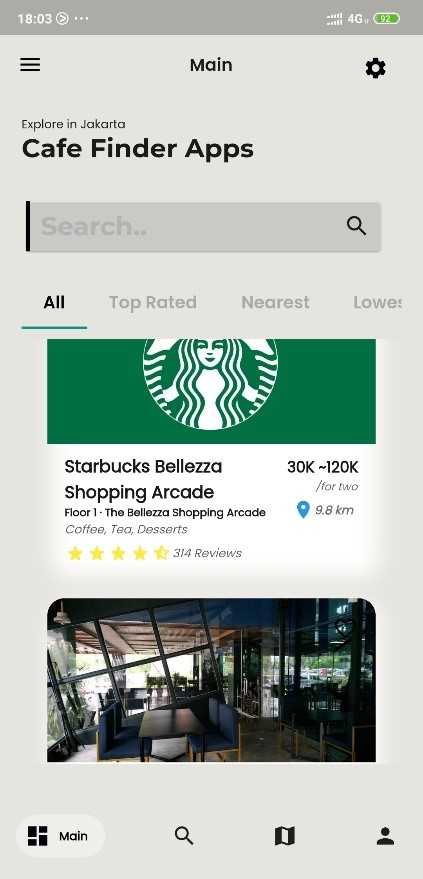
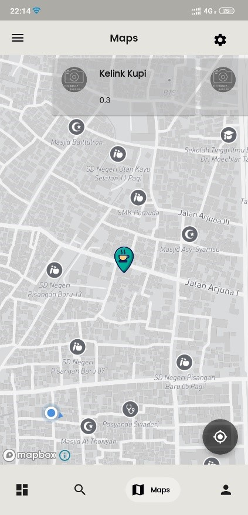
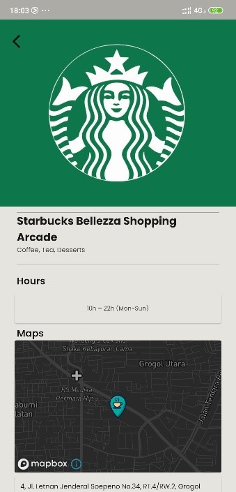
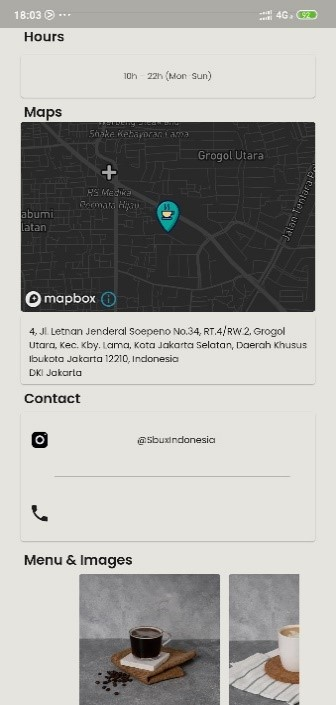

# Cafe/Coffee Shop Finder

A mobile application built with Flutter that helps users find the best cafes or coffee shops in Jakarta. The app features sorting options such as nearest, lowest price, and top-rated. It also displays maps using Mapbox and uses Firebase Firestore as the database.

## Requirements
- Any Operating System (i.e., MacOS X, Linux, Windows)
- Any IDE with Flutter SDK installed (i.e., IntelliJ, Android Studio, VSCode, etc.)
- A little knowledge of Dart and Flutter

## Features
- Search for cafes/coffee shops based on user location
- Sorting options: nearest, lowest price, top-rated
- Detailed information about cafes including address, operating hours, and user reviews
- Map integration using Mapbox
- Firebase Firestore for data storage and management

## Screenshots

## Plugins
| Name            | Usage                                      |
|-----------------|--------------------------------------------|
| `mapbox_gl`     | Map integration                            |
| `cloud_firestore` | Firebase Firestore for database          |
| `firebase_auth` | Firebase Authentication                    |
| `flutter`       | SDK for building natively compiled apps    |
| `bloc`          | State management using BLoC pattern        |

## Author
- Muhammad Noval Rifani

## License
[MIT](LICENSE)
